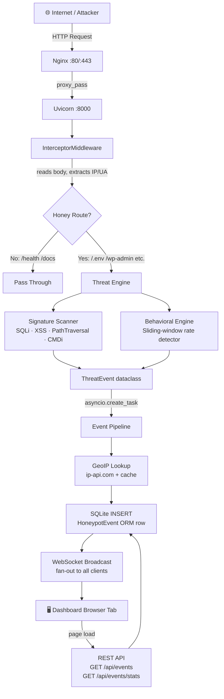

# 🍯 HoneyNet — API Honeypot & Threat Intelligence Dashboard

> A fully async Python honeypot that captures, enriches, persists, and
> streams attacker activity to a real-time dark-theme dashboard.
> Built phase-by-phase as a portfolio & learning project.

---

## Architecture Overview



---

## Tech Stack

| Layer | Technology | Why |
|---|---|---|
| **Framework** | FastAPI (async) | ASGI, native WebSocket, auto-docs |
| **Server** | Uvicorn + uvloop | Event-loop server, handles 1000s of concurrent WS connections |
| **Database** | SQLite + aiosqlite | Zero-setup persistence, async I/O, no blocking |
| **ORM** | SQLAlchemy 2.x (async) | Typed mapped_column, async session |
| **HTTP client** | httpx (async) | GeoIP lookups with shared connection pool |
| **Frontend** | Vanilla HTML/CSS/JS | No framework needed; full control |
| **Fonts** | Inter + JetBrains Mono | Clean UI + readable monospace for IPs/paths |
| **Proxy** | Nginx | TLS termination, WS upgrade headers, static caching |
| **Process** | systemd | Auto-start, crash recovery, journald logging |

---

## Project File Tree

```
honeypot/
├── app/
│   ├── main.py                 # FastAPI app · lifespan · middleware · routers
│   ├── config.py               # Settings singleton (reads .env)
│   ├── database.py             # Async SQLAlchemy engine + session factory
│   │
│   ├── engine/
│   │   ├── signatures.py       # 22 regex attack patterns (SQLi/XSS/PathTraversal/CMDi)
│   │   ├── behavioral.py       # Sliding-window rate scanner detector
│   │   └── analyzer.py         # ThreatEvent dataclass + threat level matrix
│   │
│   ├── middleware/
│   │   └── interceptor.py      # ASGI body-replay middleware
│   │
│   ├── models/
│   │   └── event.py            # HoneypotEvent SQLAlchemy ORM model
│   │
│   ├── routers/
│   │   ├── health.py           # GET /health · GET /status
│   │   ├── honeypot.py         # 11 deceptive endpoints
│   │   ├── events.py           # GET /api/events · GET /api/events/stats
│   │   └── ws.py               # WS /ws (live feed)
│   │
│   └── services/
│       ├── geoip.py            # Async GeoIP + in-memory cache
│       ├── event_store.py      # Handler registry + enrich→persist pipeline
│       └── connection_manager.py # WebSocket pool + fan-out broadcaster
│
├── static/
│   ├── index.html              # Dashboard HTML (semantic, ARIA)
│   ├── css/style.css           # Design system (glassmorphism, animations)
│   └── js/app.js               # WS client + REST + live table logic
│
├── nginx/
│   └── honeypot.conf           # Nginx reverse proxy (HTTP + WS upgrade)
│
├── deploy.sh                   # EC2 Ubuntu setup script
├── requirements.txt            # Python dependencies
├── .env                        # Environment variables (gitignored)
├── .gitignore
└── honeypot.db                 # SQLite database (runtime, gitignored)
```

---

## Phase-by-Phase Build Log

### Phase 1 — Project Scaffolding & Core FastAPI Server

**Goal:** Clean foundation — config, DB engine, app factory, health probes.

**Files created:**
- [`app/config.py`](app/config.py) — Settings singleton reading `.env` via `python-dotenv`
- [`app/database.py`](app/database.py) — `create_async_engine` + `async_sessionmaker` + `Base`
- [`app/main.py`](app/main.py) — `@asynccontextmanager` lifespan, CORS, app factory
- [`app/routers/health.py`](app/routers/health.py) — `/health` (liveness) + `/status` (readiness with DB check)
- `requirements.txt` — all deps including `greenlet` (needed on Python 3.14)

**Key bug fixed:** `greenlet` is an implicit SQLAlchemy async dependency that isn't bundled for Python 3.14. Added explicitly to requirements.

**Concepts taught:**
- ASGI vs WSGI (event loop vs thread-per-request)
- Modern `asynccontextmanager` lifespan (replaces deprecated `@on_event`)
- `sqlite+aiosqlite://` driver string and why async matters for SQLite
- FastAPI dependency injection with `Depends(get_db)`
- Liveness vs readiness probes (the difference matters to load balancers)

---

### Phase 2 — Honey-Routes, Middleware & Threat Engine

**Goal:** Intercept every request, classify it, return convincing fake responses.

**Files created:**
- [`app/engine/signatures.py`](app/engine/signatures.py) — 22 regex patterns across 4 attack categories
- [`app/engine/behavioral.py`](app/engine/behavioral.py) — `BehavioralEngine` with `collections.deque` sliding window
- [`app/engine/analyzer.py`](app/engine/analyzer.py) — `ThreatEvent` dataclass + threat level matrix
- [`app/middleware/interceptor.py`](app/middleware/interceptor.py) — ASGI `InterceptorMiddleware`
- [`app/routers/honeypot.py`](app/routers/honeypot.py) — 11 deceptive endpoints

**Honey-routes deployed:**

| Path | Mimics |
|---|---|
| `/wp-admin` | WordPress admin login |
| `/.env` | Leaked Laravel environment file |
| `/.git/config` | Exposed git repository config |
| `/api/v1/admin/config` | Misconfigured REST admin endpoint |
| `/admin` | Generic admin panel |
| `/phpinfo.php` | PHP info page |
| `/config.php` | Blank PHP config (realistic misconfiguration) |
| `/backup.zip` | 403 — teases attacker into thinking file exists |
| `/server-status` | Apache mod_status page |
| `/api/v1/users` | Paginated user list (fake credential dump) |
| `/api/v1/login` | Login endpoint returning a fake JWT |

**Threat level matrix:**
```
No sigs + no scanner  → LOW
No sigs + scanner     → MEDIUM   (automated probe, no payload)
1+ sigs + no scanner  → HIGH     (targeted attack, likely manual)
1+ sigs + scanner     → CRITICAL (automated attack tool)
```

**Concepts taught:**
- How WAFs use regex (OWASP CRS approach)
- The body-replay pattern in ASGI middleware (why you can only read `receive()` once)
- Sliding-window vs fixed-window rate limiting
- `collections.deque` for O(1) append/pop — why not a list
- `asyncio.create_task()` — fire-and-forget without blocking the HTTP response

---

### Phase 3 — Persistence & GeoIP Telemetry Enrichment

**Goal:** Every event gets a country/city/ISP appended, then saved to SQLite.

**Files created:**
- [`app/models/event.py`](app/models/event.py) — `HoneypotEvent` ORM with indexed columns
- [`app/services/geoip.py`](app/services/geoip.py) — Async GeoIP + private IP detection + cache
- [`app/services/event_store.py`](app/services/event_store.py) — Handler registry + enrich→persist pipeline
- [`app/routers/events.py`](app/routers/events.py) — `GET /api/events` + `GET /api/events/stats`

**The enrichment pipeline:**
```
ThreatEvent
  → geoip.lookup(ip)           [cached, no API call for repeat IPs]
  → HoneypotEvent(ORM row)
  → async INSERT INTO honeypot_events
  → return db_event            [Phase 4 broadcasts this]
```

**GeoIP service design:**
- Private IP detection (RFC1918, loopback, link-local) → instant `Local/Private` return
- Shared `httpx.AsyncClient` connection pool (not a new TCP connection per lookup)
- Dict cache keyed by IP (IPs don't change location; no TTL needed)
- All exceptions swallowed — a failed GeoIP call never crashes the pipeline

**Concepts taught:**
- SQLAlchemy 2.x `Mapped[T]` and `mapped_column` typed syntax
- Why `COUNT(*)` SQL aggregate beats fetching-and-counting in Python
- Shared vs per-request async HTTP clients (connection pool reuse)
- Handler registration pattern to avoid circular imports

---

### Phase 4 — WebSocket Broadcast & Live Feed

**Goal:** Every saved event is pushed in real time to every open browser tab.

**Files created:**
- [`app/services/connection_manager.py`](app/services/connection_manager.py) — WS pool + `asyncio.gather` fan-out
- [`app/routers/ws.py`](app/routers/ws.py) — `WS /ws` endpoint + `asyncio.wait_for` keepalive loop

**Updated:**
- [`app/services/event_store.py`](app/services/event_store.py) — Step 4 added: `ws_manager.broadcast(db_event.to_dict())`

**Connection lifecycle:**
```
Client opens ws://host/ws
  → manager.connect(ws)          adds to set, sends welcome message
  → loop: wait_for(receive, 30s)
      timeout → send ping        (keeps connection alive through NAT)
      message → handle (pong)
  → WebSocketDisconnect → manager.disconnect(ws)
```

**Broadcast pipeline:**
```
db_event saved (has real id + timestamp)
  → ws_manager.broadcast(db_event.to_dict())
  → asyncio.gather(*[ws.send_json(payload) for ws in set(active)])
  → stale clients auto-removed on send failure
```

**Concepts taught:**
- WebSocket HTTP upgrade handshake (`101 Switching Protocols`)
- Fan-out broadcast pattern
- `asyncio.gather` with `return_exceptions=True` for parallel sends
- Why we use a `set` (O(1) discard) not a `list` for the connection pool
- `asyncio.wait_for` for timeout-driven keepalive (vs a separate ping task)
- Broadcasting AFTER DB commit so payload has real `id` and `timestamp`

---

### Phase 5 — Dashboard UI & Nginx Deployment

**Goal:** A premium dark-theme dashboard + EC2 production config.

**Files created:**
- [`static/index.html`](static/index.html) — Semantic HTML, ARIA roles, unique IDs
- [`static/css/style.css`](static/css/style.css) — Full design system
- [`static/js/app.js`](static/js/app.js) — WS client + REST + all UI logic
- [`nginx/honeypot.conf`](nginx/honeypot.conf) — Reverse proxy config
- [`deploy.sh`](deploy.sh) — EC2 Ubuntu setup script

**Dashboard features:**
- Sticky header with live status pill (pulsing green dot when WS connected)
- Stats row: Total Events, Last 24h, Last Hour, Unique Attackers — animated count transitions
- Threat level cards with proportional fill bars + color-coded glow effects
- Live feed table: rows slide in with cyan flash animation (newest at top)
- Country flag emojis via Regional Indicator Symbol trick (no library)
- Click any row → event detail modal with full metadata
- Sidebar: Top Attackers, Top Targets, Top Countries — proportional bar charts
- Auto-reconnecting WebSocket (exponential backoff: 1.5s → 30s cap)
- REST history loaded on page open, WS takes over for live updates
- Stats auto-refresh every 30 seconds
- Relative timestamps re-ticked every 15 seconds ("2s ago" → "1m ago")

**Nginx critical settings explained:**
```nginx
location /ws {
    proxy_http_version 1.1;
    proxy_set_header Upgrade $http_upgrade;    # Required for WS handshake
    proxy_set_header Connection "upgrade";     # Required for WS handshake
    proxy_read_timeout 86400s;                 # ⚠️ CRITICAL: default 60s kills WS
    proxy_buffering off;                       # Forward frames immediately
}
```

**Concepts taught:**
- ASGI static file mounting (`StaticFiles`)
- Regional Indicator Symbol trick for flag emojis (no library)
- `easeOutCubic` counter animation with `requestAnimationFrame`
- XSS safety in JS: always `escHtml()` before `innerHTML`
- Nginx `proxy_read_timeout` — why the default 60s breaks WebSockets
- systemd hardening: `NoNewPrivileges=yes`, `PrivateTmp=yes`

---

## Running Locally

```bash
# 1. Create virtualenv
python3 -m venv venv && source venv/bin/activate

# 2. Install dependencies
pip install -r requirements.txt

# 3. Start server (hot-reload enabled in dev mode)
python -m app.main

# 4. Open dashboard
open http://localhost:8000

# 5. Fire test events (in a second terminal)
for route in /.env /wp-admin /admin /phpinfo.php /api/v1/users; do
  curl -s http://localhost:8000$route -o /dev/null
done
```

---

## API Reference

### Health
| Method | Path | Description |
|---|---|---|
| `GET` | `/health` | Liveness probe — instant 200 |
| `GET` | `/status` | Readiness probe — checks DB |

### Dashboard
| Method | Path | Description |
|---|---|---|
| `GET` | `/` | Serves the dashboard HTML |
| `WS`  | `/ws` | WebSocket live event stream |

### Events API
| Method | Path | Query params | Description |
|---|---|---|---|
| `GET` | `/api/events` | `limit`, `offset`, `threat_level` | Paginated history |
| `GET` | `/api/events/stats` | — | Aggregate stats for dashboard cards |

### Honeypot Routes (all return fake-but-realistic responses)
`/.env` · `/.git/config` · `/wp-admin` · `/admin` · `/phpinfo.php`
`/config.php` · `/backup.zip` · `/server-status`
`/api/v1/admin/config` · `/api/v1/users` · `POST /api/v1/login`

---

## WebSocket Message Protocol

**Server → Client:**
```jsonc
{ "type": "connected", "message": "...", "active_clients": 2 }  // on connect
{ "type": "event", "ip": "...", "path": "...", "threat_level": "HIGH", ... } // new hit
{ "type": "ping", "active_clients": 2, "timestamp": "..." }     // keepalive
```

**Client → Server (optional):**
```jsonc
{ "type": "ping" }   // → server replies { "type": "pong" }
```

---

## AWS Deployment (Summary)

1. **EC2:** Ubuntu 22.04, t2.micro, ap-south-1, `honeypot-sg` (ports 22/80/443)
2. **Elastic IP:** Static public IP — prevents address change on reboot
3. **Upload:** `scp -r honeypot/ ubuntu@<IP>:~/honeypot`
4. **Install:** `pip install -r requirements.txt`
5. **Config:** Write `~/honeypot/.env` with `APP_ENV=production`
6. **Service:** `sudo systemctl enable --now honeypot`
7. **Nginx:** `sudo cp nginx/honeypot.conf /etc/nginx/sites-available/honeypot` → reload
8. **SSL (optional):** `sudo certbot --nginx -d yourdomain.com`
9. **Firewall:** `sudo ufw allow 22,80,443/tcp && sudo ufw enable`

---

## Concepts Reference Index

| Concept | Where It's Used |
|---|---|
| ASGI / async event loop | Every module |
| Lifespan context manager | `main.py` |
| Body-replay middleware pattern | `interceptor.py` |
| Regex WAF signatures (OWASP CRS approach) | `signatures.py` |
| Sliding-window rate limiting | `behavioral.py` |
| SQLAlchemy 2.x async ORM | `database.py`, `models/event.py` |
| Dependency injection (`Depends`) | `routers/health.py`, `events.py` |
| `asyncio.create_task` fire-and-forget | `interceptor.py` |
| Shared httpx connection pool | `services/geoip.py` |
| Handler registration (no circular imports) | `services/event_store.py` |
| WebSocket HTTP upgrade | `routers/ws.py`, `nginx/honeypot.conf` |
| Fan-out broadcast with `asyncio.gather` | `services/connection_manager.py` |
| `asyncio.wait_for` keepalive pattern | `routers/ws.py` |
| CSS custom properties + glassmorphism | `static/css/style.css` |
| Regional Indicator Symbol flag emoji | `static/js/app.js` |
| `requestAnimationFrame` counter animation | `static/js/app.js` |
| Nginx `proxy_read_timeout` for WebSocket | `nginx/honeypot.conf` |
| systemd hardening (`NoNewPrivileges`) | `deploy.sh` |
| GeoIP private IP detection (RFC1918) | `services/geoip.py` |
